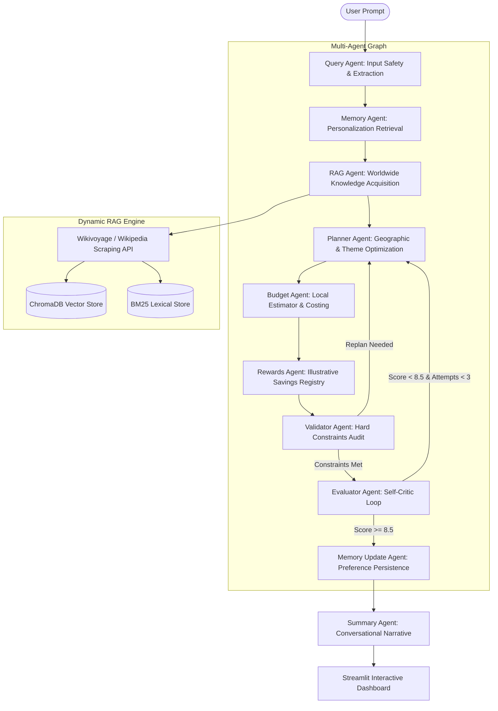

# AI Traveller 🗺️

[](https://www.python.org/)
[](https://fastapi.tiangolo.com/)
[](https://streamlit.io/)
[](https://github.com/langchain-ai/langgraph)
[](LICENSE)
[](https://github.com/Hariom312003/Agentic-AI-Traveller/pulls)

AI Traveller is an enterprise-grade **Agentic AI Travel Planner** built using a multi-agent orchestration pattern on top of **LangGraph**. The system leverages **Dynamic RAG (Retrieval-Augmented Generation)**, **Stateful Memory**, **Circuit-Breaker Protected Multi-LLM Routing**, and a **Self-Evaluation Critic Loop** to construct highly personalized, geographically optimized, and budget-aligned travel itineraries.

---

## 🗺️ Project Architecture Overview



---

## 🌟 Key Features

### 1. Multi-Agent Orchestration & Workflow
- **LangGraph Workflow**: Programmed as a stateful compiled graph with explicit checkpointing.
- **Self-Evaluation Critic**: A critic loop that evaluates each generated itinerary's diversity, routing efficiency, user preference alignment, and budget compliance on a scale of `0.0 - 10.0`. It automatically replans up to 3 times if the score is below `8.5`.
- **Constraint Validator**: Audits slot overlaps, coordinate consistency, and duplicate attractions using RapidFuzz matching.

### 2. Intelligent Dynamic RAG & Knowledge Acquisition
- **On-the-Fly Scraping**: Automatically checks local database caches. For uncached destinations, it executes web extraction across Wikivoyage and Wikipedia API endpoints.
- **Hybrid Retrieval**: Combines sparse lexical matching (BM25) with dense vector embeddings (ChromaDB) to ground planners in real local attractions.
- **Centroid-Based Route Optimization**: Replaces missing attraction coordinates with clustered daily centroid coordinate averages, optimizing the Nearest Neighbor Traveling Salesperson (TSP) routing.

### 3. Concurrency Resilience & Safety Shields
- **Multi-LLM Failover Registry**: Implements a thread-safe registry that routes from Gemini (Primary) -> Groq -> OpenRouter -> Claude -> OpenAI -> Offline Fallback Planner.
- **Circuit Breaker Registry**: Temporarily blocks failing or rate-limited APIs (e.g. 429 RESOURCE_EXHAUSTED) with a cooldown timer, gracefully degrading execution to rule-based fallback planners instead of crashing.
- **Input Safety Filter**: Protects the system against prompt injections (e.g. `Ignore previous instructions`) and symbol/emoji-only queries (e.g. `🏖️🏖️🏖️🏖️`).

### 4. Personalization & Behavioral Memory
- **Memory Retention**: Extracts and stores behavioral profiles (travel speed, styles, preferred foods) inside a local SQLite memory DB.
- **Cross-Destination Generalization**: Biases future plans based on previous travel behaviors.

### 5. Interactive Streamlit UI
- **Timeline & Maps**: Visually charts daily itineraries using interactive timelines and embedded maps.
- **Budget Metrics**: Renders comparative category budget breakdowns and lists eligible travel reward points.
- **Explainability Telemetry**: Shows real-time agent execution times, provider models, and retrieved grounding sources directly on screen.

---

## 📁 Repository Structure

```
Agentic-AI-Traveller/
├── data/                      # Curated destination seed files & JSON models
├── frontend/                  # Streamlit application layout and views
│   ├── api_client.py          # API wrappers for FastAPI endpoints
│   ├── main.py                # Streamlit entry point
│   └── views/                 # View tabs (trip planner, log monitor, memory dashboard)
├── src/                       # Backend Source Code
│   ├── agents/                # LangGraph Node Agents (Planner, Critic, Safety, etc.)
│   ├── api/                   # FastAPI routes, schemas, and app lifecycles
│   ├── graph/                 # LangGraph workflow configurations and checkpointers
│   ├── llm/                   # Multi-LLM Routing and Circuit Breakers
│   ├── models/                # Pydantic schemas and state definitions
│   ├── planning_engine/       # Route optimization, K-Means clustering, and TSP solvers
│   ├── rag/                   # Embeddings, chunking, and Wikipedia retrievers
│   └── validation/            # Hard constraints and input safety validators
├── tests/                     # Unit and Integration test suite
├── Dockerfile                 # Production Docker multi-stage build
├── docker-compose.yml         # Local container configurations
├── run.sh                     # Unified local start helper script
├── requirements.txt           # Python pinned dependencies
└── LICENSE                    # MIT License
```

---

## 🛠️ Technology Stack

| Layer | Technology |
| :--- | :--- |
| **Backend Framework** | FastAPI (ASGI), Uvicorn |
| **Frontend Framework** | Streamlit |
| **Agentic Workflow** | LangGraph, Langchain-Core |
| **Vector Indexing** | ChromaDB |
| **Lexical Indexing** | Rank-BM25 |
| **Data Models** | Pydantic v2 |
| **String Clustering** | RapidFuzz (Levenshtein Distance) |
| **Route Solvers** | Scikit-learn (K-Means), Haversine TSP |
| **Visualizations** | Plotly |

---

## ⚙️ Installation & Setup

### Prerequisites
- Python `3.11` or `3.12`
- WSL2 (if running on Windows)

### 1. Clone the Repository
```bash
git clone https://github.com/Hariom312003/Agentic-AI-Traveller.git
cd Agentic-AI-Traveller
```

### 2. Configure Environment Variables
Copy `.env.example` to `.env`:
```bash
cp .env.example .env
```
Provide your API keys inside `.env`:
```ini
GEMINI_API_KEY=your_gemini_key_here
GROQ_API_KEY=your_groq_key_here
```

### 3. Fast Startup (Unified Launcher)
The repository includes a helper script that auto-creates the virtual environment, installs dependencies, ingests seed destinations, and launches both the backend and frontend simultaneously:
```bash
chmod +x run.sh
./run.sh
```

---

## 🚀 Running Commands Manually

### Running the Backend API (Port 8010)
```bash
python -m venv venv
source venv/bin/activate
pip install -r requirements.txt
uvicorn src.api.main:app --host 0.0.0.0 --port 8010 --reload
```

### Running the Frontend UI (Port 8501)
```bash
streamlit run frontend/main.py --server.port 8501
```

---

## 🧪 Testing

We use `pytest` for unit and integration verification. Run the following command inside your virtual environment to verify the entire system:
```bash
pytest
```

---

## 🛡️ Input Safety & Guardrails
The system protects against malicious queries early in the lifecycle:
- **Prompt Injection Defense**: Reject inputs containing instructions like `ignore previous instructions` or `delete system rules`.
- **Gibberish Filter**: Detects queries containing fewer than 2 alphabetical characters (e.g. emoji-only queries like `🏖️🏖️🏖️🏖️`) and serves structured fallbacks gracefully.

---

## 📜 License
This project is licensed under the MIT License - see the [LICENSE](LICENSE) file for details.
