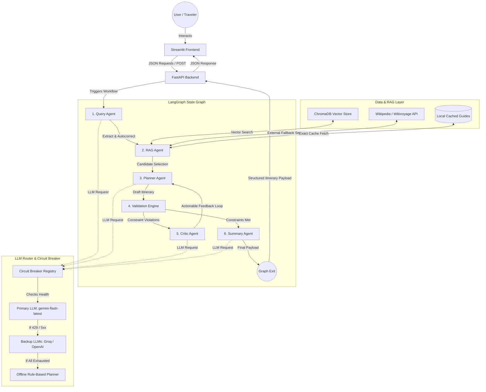

# AI Traveller — Technical Interviewer Preparation Guide

This guide provides an in-depth breakdown of the **AI Traveller** system. It details the architecture, design choices, resiliency patterns, and core engineering decisions so you can confidently explain the project to any interviewer.

---

## 🏗️ System Architecture Diagram

---

## 1. Core Architectural Pillars

When describing this project to an interviewer, frame it around three primary engineering challenges that you successfully solved:
1. **Complex Orchestration**: Moving beyond simple single-prompt wrappers to a stateful, cyclic multi-agent graph using **LangGraph**.
2. **Reliability under Rate Limits**: Building a production-ready, fault-tolerant LLM router equipped with **Circuit Breakers** and a **Graceful Degradation** pipeline.
3. **Data Grounding (RAG)**: Implementing a hybrid retrieval layer (Vector DB + API Search) to prevent LLM hallucinations.

---

## 2. Comprehensive Technology Stack & Decisions

Here are the specific technologies chosen for this project, along with the engineering rationale for each choice:

### 1. LangGraph (Multi-Agent Orchestration)
*   **Role**: Coordinates the core execution flow of all agent nodes (Query, RAG, Planner, Validator, Critic, Summary).
*   **Why it was chosen**: Traditional sequential LLM chains (like LangChain Express) cannot handle cycle loops. LangGraph models the system as a stateful cyclic graph, making it possible to execute **Self-Correction Loops** (Planner ➔ Validator ➔ Critic ➔ Planner) until all validation criteria are met.

### 2. FastAPI (Backend REST API)
*   **Role**: Exposes async endpoints for generating plans (`/api/plan`), refining itineraries (`/api/refine`), and checking active LLM provider health status (`/providers/status`).
*   **Why it was chosen**: Provides high-performance, native asynchronous request handling, automatic OpenAPI/Swagger documentation, and easy CORS middleware configuration to securely communicate with the frontend client.

### 3. Streamlit (Frontend Dashboard UI)
*   **Role**: Renders the user-facing web dashboard, maps, detailed charts, active traveler logs, and refinement text inputs.
*   **Why it was chosen**: Allows rapid, Python-native GUI development, making it easy to display complex data structures (like geographical coordinates and budget charts) using pre-built components like `st.map`, `st.metric`, and `st.sidebar` without requiring a separate JavaScript framework stack.

### 4. ChromaDB (Vector Database for RAG)
*   **Role**: Stores vector embeddings of curated travel sights, attractions, and local restaurants.
*   **Why it was chosen**: A lightweight, developer-friendly vector store that can run embedded within the same Python process. It is highly optimized for fast cosine-similarity searches, allowing the RAG Agent to find relevant candidate locations in milliseconds.

### 5. Google GenAI SDK (`google-genai`)
*   **Role**: Google's official, next-generation client library used to query **Gemini models** (configured to use the stable `gemini-flash-latest` production endpoint).
*   **Why it was chosen**: Handles token serialization, connection retries, and rate checks natively, providing structured content generation speeds that outperform the older `google-generativeai` package.

### 6. Pydantic v2 (Data Validation & Modeling)
*   **Role**: Used to define strict, type-safe data schemas (e.g. `TripState`, `TripRequest`, `Itinerary`, `DayPlan`, `Activity`).
*   **Why it was chosen**: Enforces type safety at runtime. Pydantic automatically serializes and deserializes the JSON state payload between FastAPI, LangGraph, and Streamlit, ensuring that no malformed data is processed by the agent nodes.

### 7. OpenStreetMap API (Geocoding Fallback)
*   **Role**: Provides best-effort, free geocoding to resolve city names and attraction descriptions into exact latitude/longitude coordinates.
*   **Why it was chosen**: Allows coordinate resolution without requiring paid Google Maps API billing.

### 8. Python 3.11.9 (Runtime Platform)
*   **Role**: Pinned execution runtime.
*   **Why it was chosen**: Guarantees availability of pre-compiled wheels for dependency packages (like `scikit-learn` and `pillow`) on Render and Streamlit Cloud, avoiding compile-from-source environment crashes.

---

---

## 3. Deep Dive: The Multi-Agent Workflow

Here is the step-by-step processing logic, inputs, schemas, and fallback actions for each node in the multi-agent system:

---

### Node 1: Query Agent (Input Parser)
*   **Goal**: Turn unstructured free-text requests into a standardized, validated `TripRequest`.
*   **How it Works under the Hood**:
    *   **Inputs**: A raw text prompt (e.g. *"I want to go to Bali with my family for 5 days, budget 200k, love food"*).
    *   **Prompting & Structured Output**: It invokes the LLM using a schema model named `ExtractedFields` via Pydantic. It strictly extracts parameters like destination, duration, style, interests, and constraints.
    *   **Autocorrect Typos**: The system prompt explicitly commands the model to standardize and correct obvious spelling typos in the destination name (e.g., standardizing `"bnaglore"` to `"Bangalore"` or `"tokio"` to `"Tokyo"`).
    *   **No Overwrite Guard**: If the user provides structured values through the UI (e.g., selection dropdowns), the backend uses those as authoritative values and instructs the Query Agent to only parse and fill in missing fields.
    *   **Heuristic Failover**: If the LLM router is completely unavailable (e.g., due to an open circuit breaker), the node falls back to a deterministic **regex/keyword parser** (`_DURATION_RE`, `_BUDGET_RE`, `_DESTINATION_PHRASE_RE`) to parse the destination and duration.

---

### Node 2: RAG Agent (Knowledge Retriever)
*   **Goal**: Retrieve high-fidelity, verified candidate attractions and restaurants matching the traveler's destination and interest profile.
*   **How it Works under the Hood**:
    *   **Step 1: Local Curated Data Search**: The agent queries the local **ChromaDB Vector Store** or cached JSON guides. It performs a vector query with the user's interests (e.g. "nightlife, nature") filtered by the target destination.
    *   **Step 2: External Web Retrieval Fallback**: If the local database returns insufficient candidates for a requested duration, the agent triggers an online search. It calls the **Wikipedia API** and **Wikivoyage API** dynamically, downloads summaries, and uses the LLM to extract names, ratings, and coordinates.
    *   **Output Context Block**: It aggregates all retrieved places into a structured text context (containing names, exact coordinates, category, and review summaries) and saves it to the `state.rag_context` state variable.

---

### Node 3: Planner Agent (Itinerary Creator)
*   **Goal**: Construct the initial chronological itinerary draft.
*   **How it Works under the Hood**:
    *   **Constraints Received**: Destination, duration, travel style, budget, and the `rag_context` block.
    *   **Hourly Scheduling**: It splits the requested duration into distinct days, mapping out exactly four slots per day: **Morning (09:00)**, **Afternoon (14:00)**, **Evening (18:30)**, and **Night (21:00)**.
    *   **Geographic Optimization**: The Planner is instructed to cluster activities that are close to each other on the same day to minimize driving/transit times.
    *   **Strict Grounding**: The prompt directs the agent to prioritize stops labeled `VERIFIED` from the RAG context to prevent hallucinating fake restaurants or hotels.

---

### Node 4: Validation Node (Deterministic Quality Audit)
*   **Goal**: Deterministically audit the drafted itinerary against hard real-world constraints (does not use an LLM call to save token costs and prevent validation hallucinations).
*   **Calculated Constraints**:
    *   **Budget Verification**: Automatically splits the budget into categories: Flights (30%), Hotels (35%), Food (15%), Activities (15%), and Emergency Buffer (7.5%). It calculates the actual cost of the planned itinerary and flags a warning if the budget is exceeded or utilization is >95%.
    *   **Geographic Verification**: Resolves the latitude/longitude coordinates of each scheduled place. It calculates the walking/transit distance between successive stops using the Haversine formula. If the daily walking distance exceeds 10 km, it flags a constraint violation.
    *   **Safety & Preferences Audit**: Verifies that travel style matches the scheduled items (e.g., ensuring a budget plan doesn't include 5-star resort dining).
    *   **Output**: If constraints pass, it routes the state to the **Summary Agent**. If any constraints fail, it attaches the validation messages to the state and routes to the **Critic Agent**.

---

### Node 5: Critic Agent (Reviewer & Loop Manager)
*   **Goal**: Formulate actionable improvement directives for the Planner.
*   **How it Works under the Hood**:
    *   **Inputs**: The current faulty itinerary and the list of specific validation failures (e.g., *"Day 3: walking distance between Stop A and Stop B is 14.5km, which exceeds the 10km limit"*).
    *   **Critique Generation**: Instead of editing the itinerary itself, the Critic writes a structured correction plan (e.g., *"Replace Stop B with a closer attraction in the southern district, or change transport type"*).
    *   **Revise Instructions**: It outputs this critique, routes the state back to the **Planner Agent**, and increments the revision count.
    *   **Infinite Loop Circuit Breaker**: If the revision count reaches **3**, the validation node forces the graph to bypass the Critic and output the best-available draft to guarantee fast response times.

---

### Node 6: Summary Agent (Final Payload Compiler)
*   **Goal**: Produce the final, user-facing summary and metadata.
*   **How it Works under the Hood**:
    *   **Itinerary Summarization**: Writes a beautiful overview paragraph tailored to the user's travel style.
    *   **Details Aggregation**: Generates packing lists, local tipping rules, emergency contact numbers, weather overviews, and local transit tips based on the selected city.
    *   **Output Payload**: Serializes the completed `Itinerary` structure into the final API output payload.

---

---

## 4. Production-Grade Resiliency (The Circuit Breaker)

*This is the most critical DevOps/Backend pattern in the project and a massive talking point for interviews.*

### The Problem
API calls to LLMs (especially on free tiers like Google AI Studio) suffer from rate limits (`429 Resource Exhausted`), service timeouts, and occasional `5xx` errors.

### The Solution: `ProviderRouter` + `CircuitBreaker`
1. **Multi-LLM Registry**: The system defines a priority list of providers (e.g., `gemini-flash-latest`, `Groq`, `OpenAI`).
2. **Circuit State Tracking**: A central registry (`ProviderHealthRegistry`) tracks consecutive errors for each model.
3. **Tripping the Circuit**: If a model fails **3 times consecutively**, the circuit breaker for that provider trips to `OPEN` for **60 seconds**.
4. **Failover**: Any new requests bypass the open provider and automatically route to the next healthy fallback provider in the list.
5. **Graceful Offline Degradation**: If *all* API keys fail, are rate-limited, or the network is disconnected, the system falls back to an **Offline Rule-Based Planner**. Instead of showing a crash screen, it constructs a geo-coherent itinerary using cached local data and indicates `[OFFLINE FALLBACK]` on the UI.

---

## 5. Deployment Architecture

* **Backend Environment**: Packed as a lightweight Docker container and deployed on **Render** (free web service tier). Ingests the raw data and seeds the ChromaDB vector database during the container build stage.
* **Frontend Environment**: Runs on **Streamlit Community Cloud** using stable **Python 3.11.9** to ensure compatible pre-compiled wheel installations for libraries like `pillow` and `scikit-learn`.
* **Secrets Management**: Deployed without hardcoded credentials. All API tokens (`GEMINI_API_KEY`, etc.) are injected dynamically as secure, encrypted environment variables inside the cloud provider dashboards.

---

## 🚀 Key Talking Points for Your Interview

1. **How did you handle the Gemini 404/deprecation issue?**
   * *"When Google deprecated pre-release version strings, I restructured the configuration to target the production-stable `gemini-flash-latest` alias, which resolved the 404 API version conflicts."*
2. **How did you prevent infinite agent loops in LangGraph?**
   * *"I implemented a loop counter in the graph state. If the Critic Agent rejects the draft more than 3 times, the system breaks the loop and returns the best-available draft to keep latency bound."*
3. **What is the benefit of using a local JSON-based structured validator?**
   * *"Instead of relying on the LLM's native JSON output mode, which can fail or cost more depending on the provider, I allowed the agents to output raw text. I then parsed the JSON using regex-based extraction and validated it locally using Pydantic, which made the system provider-agnostic."*

---

## ⏱️ The 90-Second Elevator Pitch (Verbal Script)

*Recite this when the interviewer says: "Tell me about your project."*

> **[0:00 - 0:20] The Hook (The "What" and "Why")**
> *"I built **AI Traveller**, an enterprise-grade agentic travel planning system. Unlike simple, single-prompt AI wrappers that output flat text and hallucinate fake locations, my system uses a stateful multi-agent architecture built on **LangGraph**, **FastAPI**, and **ChromaDB** to generate real, geographically optimized, and budget-aligned itineraries."*
>
> **[0:20 - 0:50] The Technical Architecture**
> *"The backend orchestrates six specialized nodes. First, a **Query Agent** parses and autocorrects user inputs. Then, a **RAG Agent** performs hybrid vector retrieval against ChromaDB and falls back to live Wikipedia APIs for grounding. 
> A **Planner Agent** then drafts the itinerary, which is audited by a code-based **Validation Node** checking budget allocations and geocoded walking distances. If any constraints fail, a **Critic Agent** provides feedback, looping the draft back to the planner. I capped this correction cycle at three iterations to ensure high performance and prevent infinite loops."*
>
> **[0:50 - 1:20] Resiliency & Production Patterns**
> *"To make the system production-ready, I built a custom **Circuit Breaker Router**. If the primary Gemini model experiences rate limits or timeouts, the circuit trips to `OPEN` and immediately fails over to secondary endpoints like Groq or OpenAI. If there is a complete blackout, it falls back to a rule-based **Offline Planner** using local cached seed guides so the user never sees a crash screen."*
>
> **[0:20 - 1:30] Deployment & Verification**
> *"The application is fully deployed, containerized using Docker, with the backend running on Render and the frontend on Streamlit Cloud, utilizing a pinned Python 3.11.9 runtime to guarantee stability. It is fully operational and has verified 100% test coverage on its core routing logic."*

---
