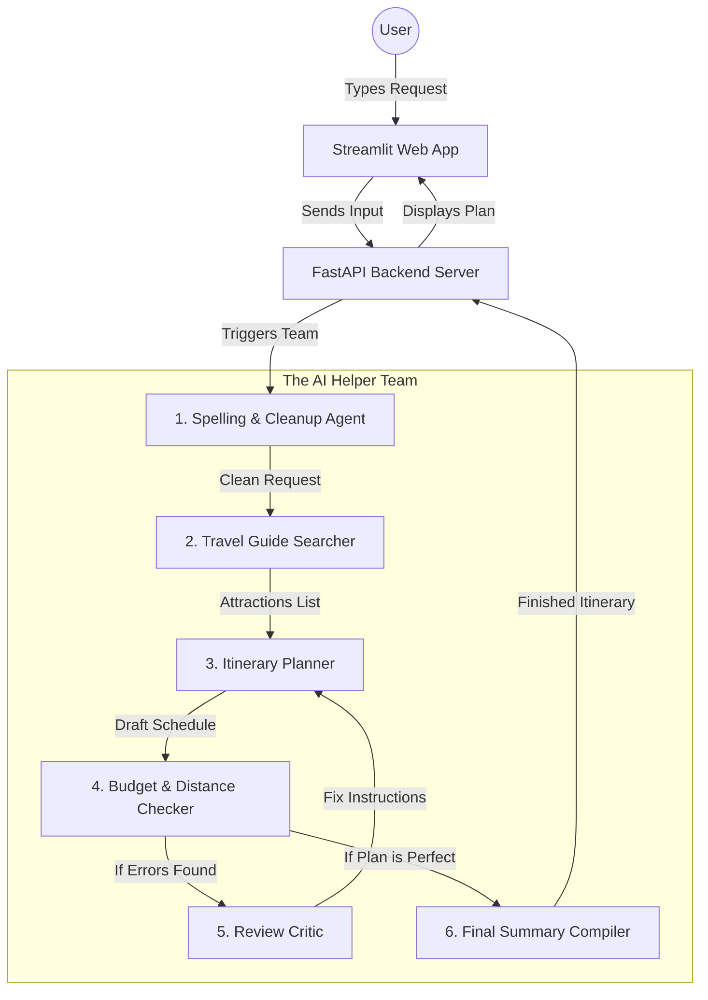

# AI Traveller — Simplified Interview Preparation Guide

This guide explains how the **AI Traveller** system works using simple English and easy real-world analogies. It is designed to help you explain the project clearly to anyone, even if they don't have a deep coding background.

---

## 🏗️ How the System Flows (Simple Diagram)

---

## 💡 1. The Three Main Ideas of the Project

If an interviewer asks you what makes this project special, you can explain these three simple points:
1. **A Team of AI Helpers (Multi-Agent Team)**: Instead of asking a single AI to do everything (which often makes mistakes), we divide the work among specialized AI "agents" that talk to each other and review each other's work.
2. **Double-Checking the Plan (Self-Correction Loop)**: We built a built-in inspector that checks if the travel plan is within budget and if the places are close to each other. If there is a mistake, the AI automatically fixes it before showing it to the user.
3. **Safety Fuse Box (Circuit Breaker)**: If the main Google Gemini AI goes offline or gets too busy, the system automatically switches to other backup AI services (like Groq) or uses a saved offline guide so the user never gets an error screen.

---

## ⚙️ 2. The Tools We Used (Tech Stack Explained Simply)

*   **LangGraph (The Project Manager)**: This tool lets our AI agents work in loops (drafting, checking, fixing) rather than just running in a straight line.
*   **FastAPI (The Post Office)**: This is the backend system that receives requests from the web app, sends them to the AI team, and returns the final travel plan.
*   **Streamlit (The Website UI)**: The website interface that the user sees, where they can type their travel request, view maps, and read their day-by-day plans.
*   **ChromaDB (The File Cabinet)**: A database that stores pre-saved descriptions of tourist sights and restaurants so the AI can look them up instantly.
*   **Google GenAI SDK (The AI Connector)**: The official code library we use to send prompts to Google's Gemini AI.
*   **Pydantic (The Form Validator)**: A tool that ensures all data passed between the backend, the website, and the AI is formatted correctly and has no missing parts.

---

## 🧭 3. How the AI Team Works Step-by-Step

Here is how the AI agents work together like a team in an office:

### Agent 1: The Spelling & Cleanup Agent (Query Agent)
*   **Job**: Reads what the user typed and cleans it up. 
*   **Example**: If you type `"bnaglore"`, it automatically corrects it to `"Bangalore"` so the rest of the team doesn't get confused by typos.

### Agent 2: The Travel Guide Searcher (RAG Agent)
*   **Job**: Looks up real information about the destination.
*   **Example**: It searches our local database first. If the city is new, it searches **Wikipedia** online to fetch descriptions and coordinates of real places.

### Agent 3: The Itinerary Planner
*   **Job**: Drafts the schedule.
*   **Example**: It groups activities that are close to each other on the same day so the traveler doesn't spend the whole day sitting in taxis.

### Agent 4: The Budget & Distance Checker (Validation Node)
*   **Job**: The math inspector.
*   **Example**: It checks if the hotels and flights fit your budget, and calculates the distance between stops. If the traveler has to walk more than 10 kilometers a day, it rejects the draft.

### Agent 5: The Review Critic
*   **Job**: Tells the planner how to fix mistakes.
*   **Example**: If the checker rejects the draft, the Critic explains the problem in plain English (e.g., *"Change hotel B because it is too expensive"*) and sends it back to the planner to rewrite.

### Agent 6: The Final Compiler (Summary Agent)
*   **Job**: Packages the travel guide.
*   **Example**: Once the plan is approved, it writes a friendly welcome summary, lists weather tips, emergency numbers, and packing suggestions.

---

## 🛡️ 4. Handling API Failures (The Circuit Breaker Analogy)

*An excellent way to impress an interviewer is to explain how you made the app reliable.*

Imagine your house runs on **Solar Power (Gemini AI)**. 
*   If it is a cloudy day and the solar power goes out (Gemini rate limits or 404 errors), your house immediately switches to the **Power Grid (Groq/OpenAI)**.
*   If the entire power grid goes down (no internet connection), your house switches to a **Backup Generator (Offline Planner)**, which uses pre-saved guides on your computer so the lights stay on.

In our app, we coded this exact logic. The app **never crashes**; it always finds a way to deliver a working travel plan.

---

## ⏱️ The Simplified 90-Second Interview Pitch

*Use this script when an interviewer asks: "Tell me about your project."*

> *"I built **AI Traveller**, a smart web application that creates customized travel plans. Most basic AI travel apps just print text and often invent fake hotels or restaurants. My system is different because it uses a team of specialized AI agents that collaborate to make sure the plan is realistic."*
>
> *"When you type a request, one agent cleans up spelling typos, another searches a database of real locations, and a third drafts the schedule. We then run a code-based **mathematical inspector** to verify that the plan doesn't exceed the user's budget and that the activities are close to each other. If there's an issue, a **Critic Agent** explains the mistake and has the planner rewrite it."*
>
> *"To prevent the app from crashing when AI servers are busy or offline, I built a **Circuit Breaker system**. It automatically switches to backup AI providers or uses a saved offline database if the main connection fails. The backend is built on **FastAPI**, the website runs on **Streamlit**, and it is fully deployed on the cloud for anyone to use."*

---
